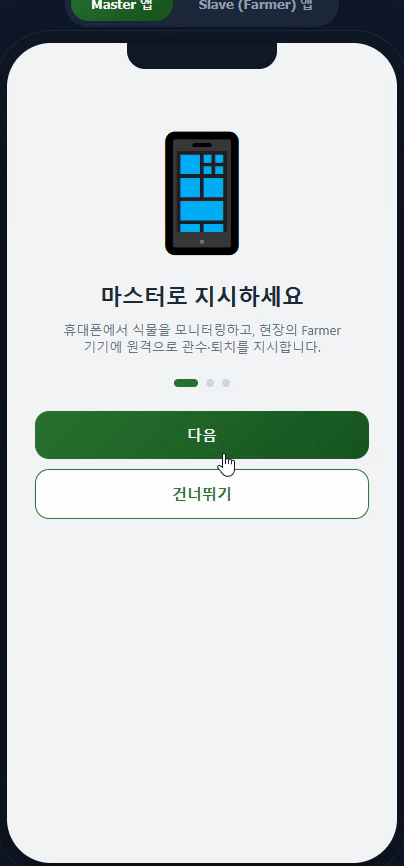
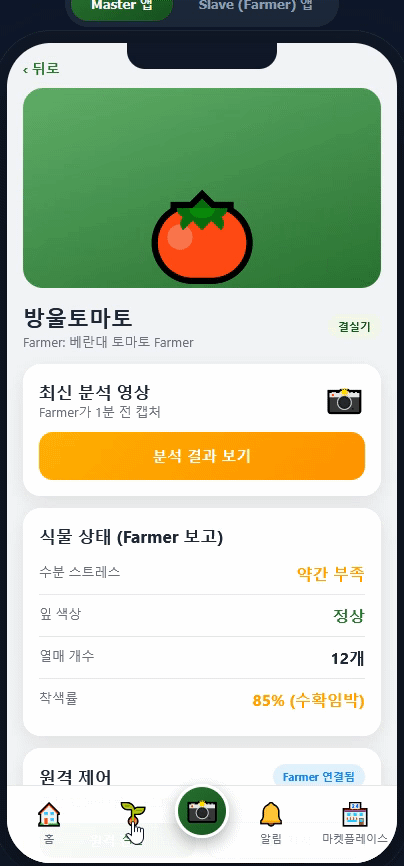
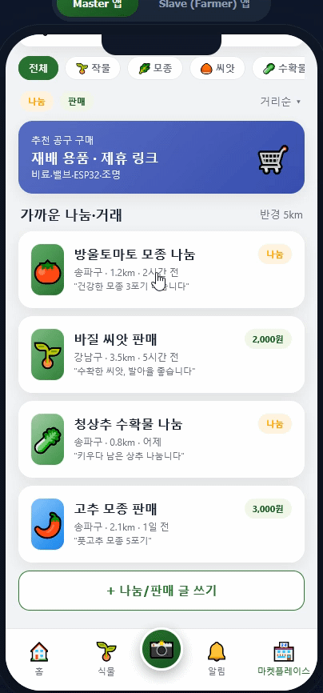

<p align="center">
  
</p>

<h1 align="center">OOJOO FARM</h1>

<p align="center">
  <strong>Grow. Care. Share. Harvest.</strong><br/>
  A two-device Android system that lets anyone grow edible crops at home — autonomously.
</p>

<p align="center">
  
  
  
  
  
  
</p>

<p align="center">
  <a href="https://www.youtube.com/shorts/wbNv0V2V0TQ">
    
  </a>
</p>

<p align="center"><sub>▶ Watch the OOJOO FARM demo on YouTube Shorts</sub></p>

---

## What is OOJOO FARM?

OOJOO FARM is a home edible-crop growing system built around a simple idea:

> **Your phone tells it what to grow. A spare phone in front of the plant grows it.**

Instead of expensive IoT controllers, OOJOO FARM re-purposes any old or low-cost Android phone as a dedicated **Farmer** — placed next to your plants, running an on-device AI that watches, waters, and alerts you when it's time to harvest. You keep your main phone in your pocket and monitor everything from the **Master** app.

### Two Apps, One Garden

| App | Installed On | Role |
|-----|-------------|------|
| **Master** | Your personal phone | Monitor, remote-control, receive alerts, household sharing, community & marketplace |
| **Slave (Farmer)** | A fixed device next to plants | Continuous camera monitoring, on-device health CNN, autonomous watering, hardware control |

The two devices are linked by a randomly generated pairing code — no complex setup. Invite family and friends with a 6-digit household code to share the garden together.

---

## What's New (Build 2026081910)

- **On-device plant health CNN × 8 species** — a tiny custom CNN (custom `OJP1` format, ~20 KB per model) now runs entirely on the Farmer phone for cherry tomato, basil, cactus, herb (rosemary), strawberry, pepper, pumpkin, and zucchini. It classifies 6 health causes — `healthy`, `water_low`, `water_high`, `light_low`, `pest`, `heat` — and auto-triggers watering or the Fan accordingly. Retrained on pot-invariant data so planter color doesn't skew predictions, and evaluated on 90 held-out Creative-Commons web photos.
- **Household sharing** — the Master owner invites family/friends with a 6-digit code; members co-own and co-operate the same Farmers, plants, and notifications (watering, Fan, laser, camera).
- **Growth photo album & short clips** — the Farmer saves a photo daily (or when the plant visibly changes); the Master's **Make Short Clip** turns the album into a short MP4 with time/location overlays and generated pentatonic BGM, rendered entirely on the Farmer device.
- **Email/password authentication** — the Master app now supports real accounts with email + password (in addition to the anonymous quick-start), with server-side sessions.
- **In-app server address setting** — both apps let you change the backend URL with validation and a `GET /health` connectivity check before reconnecting; ideal for switching between emulator, LAN, and deployed servers.
- **Korean / English localization** — full UI language switching in both apps (persists across reboots).
- **ML tooling** — browser-based labeling tool (`ml/plant_health/label_web/`), dataset fetchers, fine-tuning scripts, and per-species training metrics under `ml/plant_health/metrics/`.

See [`docs/builds/`](docs/builds/) for per-build release notes.

---

## Why It Matters for the Community

Home-grown food is more than a hobby — it's a step toward **food security, sustainability, and stronger neighborhoods**.

OOJOO FARM lowers the barrier to growing your own vegetables, herbs, and fruits. Not everyone has the time to water plants every day or the knowledge to spot pests and disease early. By automating the hard parts with a phone you already own, we make fresh, safe, home-grown produce accessible to **families, beginners, and busy professionals alike**.

Beyond the individual garden, OOJOO FARM is designed to build **local growing communities**:

- **Share your harvest** — Post surplus vegetables to neighbors within a few kilometers. Reduce food waste, build relationships.
- **Learn together** — Regional feeds let growers swap tips, show off their crops, and help newcomers succeed.
- **Reuse, don't discard** — That old Android phone in your drawer becomes a diligent gardener instead of e-waste.
- **Know your food** — When you grow it yourself, you know exactly what's on your plate: no mystery pesticides, no long supply chains, just sunlight, water, and care.

Every garden on OOJOO FARM is a small act of self-reliance. Together, those gardens add up to greener, healthier, more connected communities.

---

## Architecture

```
┌─────────────────────────┐         ┌──────────────────────────────┐
│      Master App          │         │     Slave App (Farmer)        │
│  (Your phone)            │  Pair   │  (Fixed device at plant)       │
│                          │  Code   │                              │
│  · Dashboard / Remote    │ ◀─────▶ │  · Continuous Camera Capture  │
│  · Harvest / Pest Alerts │  Sync   │  · On-Device Health CNN (OJP1)│
│  · Household Sharing     │         │  · Growth Album + Clip Render │
│  · Community / Market    │         │  · Auto Water / Pest Control  │
│  · Farmer Pairing        │         │  · Hardware Control (BLE)     │
└─────────────────────────┘         └──────────────┬───────────────┘
        ▲                                            │ BLE / Wi-Fi
        │ Push / Status                               │
        │                                            ▼
   ┌────┴────┐                            ┌────────────────────┐
    │  Cloud   │  Weather API, Accounts,    │ External Hardware   │
    │  Backend │  Household, Photos,        │ (Valve/Fan/Laser)   │
    │  (Node)  │  Community, Market         └────────────────────┘
    └─────────┘
```

---

## Key Features

### Master App
- **Authentication** — Email/password sign-up & sign-in with server-side sessions, or anonymous quick-start (nickname + growing region)
- **Onboarding** — Set the backend URL on first launch; change it any time in Settings with a health-checked reconnect
- **Dashboard** — Plant & Farmer overview, region-based weather, quick remote watering
- **Plant Management** — Register crops, track growth stages, view watering history & events, browse the accumulated photo album
- **Growth Clips** — One tap asks the Farmer to render a short growth-story MP4 (time/location overlay + BGM) and plays it inline
- **Household Sharing** — Invite family/friends with a 6-digit code; shared Farmers and plants show a "shared" badge and can be operated by all members
- **Farmer Management** — Device status (online/offline), autonomous policy settings, pause/resume
- **Pairing** — Generate a random 6-digit code or QR; valid for 10 minutes
- **Remote Commands** — Queue watering or mode-change instructions for offline Farmers
- **Community** — Region-based neighbor feed for **share / sell / buy** posts (crop, quantity, price), comments, reserve/complete with reputation, and report/block moderation
- **Marketplace** — Category-browsable supplies (fertilizer, seeds, valves, ESP32, sensors, recommended slave phones), search, plant-based recommendations, curated bundle kits, cart & checkout with order history, and affiliate links (CPS/CPA) for external items
- **Localization** — Full Korean / English UI with in-app language switching

### Slave (Farmer) App
- **Continuous Camera Monitoring** — CameraX live preview with periodic capture
- **On-Device Health CNN** — `PlantHealthNet` runs species-specific tiny CNNs (custom `OJP1` format, ~20 KB) fully on-device for 8 crops: cherry tomato, basil, cactus, herb, strawberry, pepper, pumpkin, zucchini. Classifies `healthy / water_low / water_high / light_low / pest / heat`; falls back to the color heuristic for unknown species
- **Autonomous Watering** — CNN or heuristic detects water stress and triggers the valve automatically, adjusted by cached weather data
- **Pest Detection & Control** — CNN `pest` class or on-device insect heuristic → autonomous Fan (per policy) and Laser (auto or Master-approved) response
- **Harvest Detection** — Fruit-ripeness heuristic → harvest-ready alerts to the Master (debounced)
- **Growth Album & Clips** — Saves one photo per day (or on notable change) to a local album and syncs it to the server; renders growth-story MP4 clips with timestamp/location overlays and generated pentatonic BGM when the Master requests one
- **Hardware Control** — Pluggable `HardwareController` abstraction: BLE (ESP32 / Nordic UART Service) control of solenoid valve, fan, and laser with a built-in **fail-safe auto-off timer**; falls back to a simulation controller when no hardware is paired. Watering opens the valve for a volume-proportional duration.
- **Offline Resilience** — Operates autonomously for 24+ hours without network; failed event/watering reports are queued locally and **synced on reconnection**
- **Headless Mode** — Foreground service + wake lock keep the autonomous engine running with the screen off; auto-restarts after reboot (BootReceiver) and reports battery on heartbeat
- **Server Reconnect** — Change the backend address in Settings with URL validation and `/health` check; reconnects the engine without unpairing
- **Localization** — Korean / English UI with in-app language switching

### Backend
- **Account API** — Anonymous accounts (nickname + region) **and** email/password accounts with session tokens
- **Household API** — `households` / `household_members` / `household_invites` tables; 6-digit invite codes (email optional); pairing/plants/notifications endpoints aggregate resources across household members
- **Photos API** — `plant_photos` table for the growth album (upload/list per plant)
- **Videos API** — Growth-clip uploads (`kind=growth`, photo count) with playback URLs
- Pairing authentication & **session-key auth** (slave endpoints require `x-session-key`)
- Plant, event, and watering data store (indexed for fast lookups)
- **Command queue** — Master posts commands; Slave polls & executes
- **Autonomous policy API** — Master sets per-Farmer policy (auto-water / fan / laser approval / capture interval / region); Slave syncs it on boot
- **Weather API** — Open-Meteo integration with 30-minute cache and watering-factor calculation
- **Marketplace API** — Products (categories/search), curated bundles, plant-based recommendations, affiliate click tracking, cart checkout (orders + stock decrement) & order history
- **Community API** — Region-scoped feed (share/sell/buy) with filters & search, comments, status (reserve/complete) with reputation scoring, and report/block moderation
- **Health endpoint** — `GET /health` used by both apps to validate a server address before connecting

---

## On-Device Plant Health AI

The Farmer app ships species-specific tiny CNNs in `android/slave/app/src/main/assets/models/` (`*.bin`, ~20 KB each — no model download, no cloud inference):

| | |
|---|---|
| **Format** | Custom `OJP1` (flat int8 weights + header), read by `PlantHealthNet.kt` |
| **Architecture** | 48×48 RGB input → conv8-16-24 + GAP → 6-class dense |
| **Classes** | `healthy`, `water_low`, `water_high`, `light_low`, `pest`, `heat` |
| **Species** | cherry tomato, basil, cactus, herb, strawberry, pepper, pumpkin, zucchini |
| **Actions** | `water_low` → auto-water · `pest` → Fan on |

Unknown species fall back to the original color heuristic, so every plant still gets autonomous care.

### ML Pipeline (`ml/plant_health/`)

```
ml/plant_health/
├── train.py               # Train one species (pot-invariant recipe)
├── train_all.py           # Train every species model
├── species.py             # Species registry, labels, web-search queries
├── fetch_curated.py       # Fetch CC-licensed training photos
├── fetch_more.py          # Fetch additional web photos
├── fetch_test_images.py   # Build the held-out web test set
├── finetune_web.py        # Fine-tune on CC-licensed web images
├── split_web.py           # Train/test split for web images
├── eval_internet.py       # Evaluate on held-out web photos
├── label_web/             # Browser-based labeling tool (server.py + web UI)
├── test_internet/         # Held-out web test set manifest & split
└── metrics/               # Per-species training + web-eval metrics (JSON/MD)
```

Models are trained to be **pot-invariant** (planter color ignored) and evaluated on **452 Creative-Commons photos** (Openverse / Wikimedia / iNaturalist) with 90 held-out test images per run. Training runs locally with Python/NumPy — no GPU or cloud service required.

```bash
cd ml/plant_health
py -3 train.py --species cherry_tomato   # one species
py -3 train_all.py                        # all species
py -3 eval_internet.py                    # held-out web evaluation
```

---

## Tech Stack

| Layer | Technology |
|-------|-----------|
| Mobile | Kotlin, Jetpack Compose, Material 3, Navigation Compose |
| Networking | Retrofit 2, OkHttp, kotlinx.serialization |
| Camera / Media | CameraX (Preview, ImageCapture, ImageAnalysis), MediaCodec MP4/AAC clip rendering |
| Backend | Node.js, Express, SQLite (node:sqlite) |
| Weather | Open-Meteo API |
| Hardware | ESP32 via BLE (Nordic UART Service) — valve/fan/laser with fail-safe |
| On-device AI | Custom tiny CNN (`OJP1` format) via `PlantHealthNet` — 8 species, 6 health classes, ~20 KB per model |
| ML training | Python + NumPy (`ml/plant_health/`), CC-licensed web eval set |
| i18n | Korean (`ko`) / English (`en`) with per-app locale persistence |

---

## Project Structure

```
OOJOO-FARM/
├── README.md               # This file
├── docs/                   # Documentation
│   ├── prd.md              # Product Requirements Document (v1.1.0)
│   ├── DESIGN.md           # Design / architecture notes
│   └── builds/             # Per-build release notes
├── dist/                   # Built debug APKs (in-repo)
│   ├── oojoo-farm-master-debug.apk
│   └── oojoo-farm-farmer-debug.apk
├── scripts/                # Helper scripts
│   ├── start-backend.bat   # Windows backend launcher
│   ├── run-emulator.bat    # Windows emulator launcher
│   └── verify-locales.mjs  # i18n verification
├── assets/
│   ├── logo.svg            # App logo
│   ├── icon.svg            # App icon
│   └── demo.gif            # Animated prototype walkthrough
├── prototype/
│   ├── index.html          # Interactive HTML prototype (open in browser)
│   ├── DEMO.mp4            # Video walkthrough of all prototype screens
│   └── 38758–38760.gif     # Master app UI showcase
├── backend/                # Node.js + Express + SQLite
│   ├── run-backend.sh      # Ubuntu backend launcher
│   └── src/
│       ├── server.js
│       ├── db.js
│       ├── lib/household.js
│       └── routes/         # users, pairing, plants, events, watering, commands,
│                           #   weather, household, photos, videos, community, market, ...
├── ml/                     # Machine learning pipeline
│   └── plant_health/       # Training, labeling, eval, metrics (see above)
├── tools/                  # Dev tooling
│   └── gpu-hang-diagnostics/
└── android/                # Multi-module Android project
    ├── master/             # Master app (com.oojoo.farm.master)
    │   └── app/src/main/
    │       ├── assets/server_config.yaml   # Default server URL baked into the APK
    │       └── java/com/oojoo/farm/master/
    │           ├── MainActivity.kt
    │           ├── data/       # Prefs, Session, ServerConfig, ServerEndpoint
    │           ├── model/      # Data models
    │           ├── network/    # Retrofit API client
    │           └── ui/         # Auth, Onboarding, Dashboard, PlantList/Detail/Registration,
    │                          #   FarmerList, Family (household), Pairing, ThemeEditor, ...
    └── slave/              # Slave/Farmer app (com.oojoo.farm.slave)
        └── app/src/main/
            ├── assets/models/  # OJP1 CNN weights + labels.json (8 species)
            └── java/com/oojoo/farm/slave/
                ├── MainActivity.kt
                ├── album/      # PlantAlbum (growth photo album)
                ├── data/       # SharedPreferences (Prefs), ServerEndpoint
                ├── model/      # Data models
                ├── network/    # Retrofit API client
                ├── service/    # Foreground autonomous engine
                ├── vision/     # CameraX, PlantAnalyzer, PlantHealthNet (CNN),
                │               #   GrowthClipRenderer (MP4 + BGM)
                └── ui/         # Pairing, Dashboard, Settings screens
```

---

## Try the Interactive Prototype

<p align="center">
  <video src="prototype/DEMO.mp4" width="400" controls muted loop autoplay alt="OOJOO FARM Prototype Demo">
    Your browser does not support the video tag. <a href="prototype/DEMO.mp4">Download the demo</a>
  </video>
</p>

Don't want to set up the whole development environment? You can experience OOJOO FARM right now in your browser.

The project ships with a **fully interactive HTML prototype** that simulates both the Master and Slave (Farmer) apps on realistic phone frames. No build tools, no emulator — just open the file and tap around.

The video above shows a walkthrough of all screens — Master app (splash, onboarding, home dashboard, plant detail, AI scan, remote watering, notifications, harvest alert, pest detection, pairing, settings, marketplace, listing, chat, profile, tools) and Slave/Farmer app (splash, intro, pairing, camera guide, hardware pairing, autonomous dashboard, watering event).

### Master App UX/UI Showcase

<p align="center">
  
  &nbsp;
  
  &nbsp;
  
</p>

<p align="center"><sub>Master app screens: dashboard, plant monitoring, remote watering, alerts, pairing, and community marketplace</sub></p>

### How to Open

Open `prototype/index.html` directly in any modern browser:

```
prototype/index.html
```

Or clone the repo and double-click the file. That's it.

### What You Can Explore

The prototype lets you switch between two simulated devices with a toggle at the top:

#### Master App (green theme)
| Screen | What to try |
|--------|-------------|
| **Onboarding** | Swipe through the 3-step intro — "Command from your phone", "Pair with a code", "Farmer manages autonomously" |
| **Home Dashboard** | View weather card, Farmer device status, plant carousel, quick-water button, recent alerts (harvest & pest) |
| **Plant Detail** | Tap any plant to see AI analysis results, growth stats (fruit count, ripeness %), remote control panel, and event log |
| **AI Scan Result** | View a simulated camera capture with on-device AI detection (water stress, fruit count, pest detection) |
| **Remote Watering** | Press "Water now" and watch the progress bar as the command is sent to the Farmer |
| **Harvest Alert** | See the harvest-ready notification with ripeness indicators and "mark as harvested" action |
| **Pest Detection** | View the autonomous Fan response log and manual Laser override option |
| **Pairing** | Generate a 6-digit pairing code or QR for connecting a Farmer device |
| **Settings** | Manage Farmer devices, autonomous policies (water auto / Fan auto / Laser approval), notification preferences |
| **Marketplace** *(Phase 3-4 preview)* | Browse nearby crop sharing/selling listings, categories, affiliate tool shop, write a post, chat with a neighbor, view profiles with reputation |
| **Notifications** | Full notification center with harvest, pest, watering, and reconnection events |

#### Slave / Farmer App (teal theme)
| Screen | What to try |
|--------|-------------|
| **Onboarding** | "On-device AI autonomous management", "Pair via code", "Direct hardware control" |
| **Pairing** | Type the 6-digit code on the on-screen keypad, or scan QR to connect |
| **Camera Guide** | See the live camera frame with alignment guide and plant recognition confidence |
| **Hardware Pairing** | Watch BLE scan find ESP32 modules (water valve, fan, laser), then connect |
| **Autonomous Dashboard** | Live camera preview, on-device AI status (water stress, fruit detection, insect detection, AI decision), autonomous policy table, last watering info, action log, headless mode toggle, connection/battery status |
| **Autonomous Watering Event** | Trigger a watering action and watch the valve progress bar with fail-safe timer |

> **Tip:** The prototype uses mock data and simulated animations — it reflects the intended UX, not live backend data. It's the same prototype used during product design review.

<p align="center">
   &nbsp; <em>Open the prototype and switch between Master and Farmer to see the full flow.</em>
</p>

---

## Getting Started

### Backend

```bash
cd backend
cp .env.example .env
npm install
npm start          # http://localhost:4000
```

For development with auto-reload: `npm run dev`

### Android

1. Open **Android Studio** → **Open** → select the `android/` folder
2. Wait for Gradle Sync to complete
3. Select **app (master)** or **app (slave)** from the run configuration dropdown
4. Press **Run** (Shift+F10)

### Pointing the Apps at Your Server

- The default server URL is baked in from `android/*/app/src/main/assets/server_config.yaml` — edit it before building (e.g. `http://<your-LAN-IP>:4000/` for physical devices).
- The emulator default `http://10.0.2.2:4000/` is used when no config value is set.
- You can also change the server address at runtime in **Settings → Server Connection** in either app; the address is validated and health-checked (`GET /health`) before it is saved and applied.

### Pre-built APKs

Ready-to-install debug APKs for both apps live in [`dist/`](dist/):

```
dist/oojoo-farm-master-debug.apk
dist/oojoo-farm-farmer-debug.apk
```

### Languages

Both apps default to Korean and can be switched to English in **Settings**; the choice persists across reboots. Run `node scripts/verify-locales.mjs` to verify string parity.

---

## Roadmap

| Phase | Scope | Status |
|-------|-------|--------|
| **Phase 1 — MVP** | Pairing, camera capture, on-device analysis, autonomous watering, command queue, weather | ✅ Done |
| **Phase 2** | Harvest/pest detection, Fan/Laser control, BLE hardware, offline sync, reports | ✅ Done |
| **Phase 3** | Location-based community (share/sell/buy), comments, reputation, moderation | ✅ Done |
| **Phase 4** | Marketplace, cart/checkout, affiliate links, subscription plans | ✅ Done |
| **Phase 5** | On-device CNN health models (8 species, OJP1), household sharing, growth clips, email/password auth, ko/en localization, multi-Farmer/crop | ✅ Done |
| Phase 6 | FCM push notifications, more species models, model personalization from user-labeled photos | Planned |

> FCM push requires a Firebase `google-services.json`. On-device inference already uses real trained CNNs (custom `OJP1` format) — no cloud required.

See [`docs/prd.md`](docs/prd.md) for the full product requirements document and [`docs/builds/`](docs/builds/) for per-build release notes.

---

## License

Proprietary — WOOJU INDUSTRY. All rights reserved.

---

<p align="center">
  <em>"The master phone commands. The Farmer phone grows. Anyone can plant, grow, share, and harvest — at home."</em>
</p>

<p align="center">
  Built by <strong>WOOJU INDUSTRY</strong>
</p>
