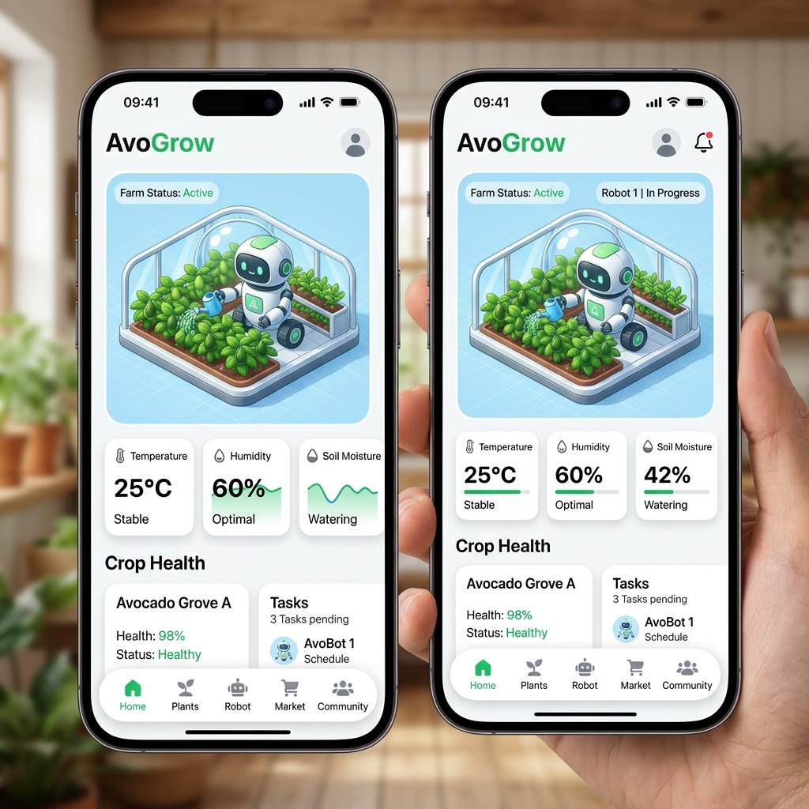
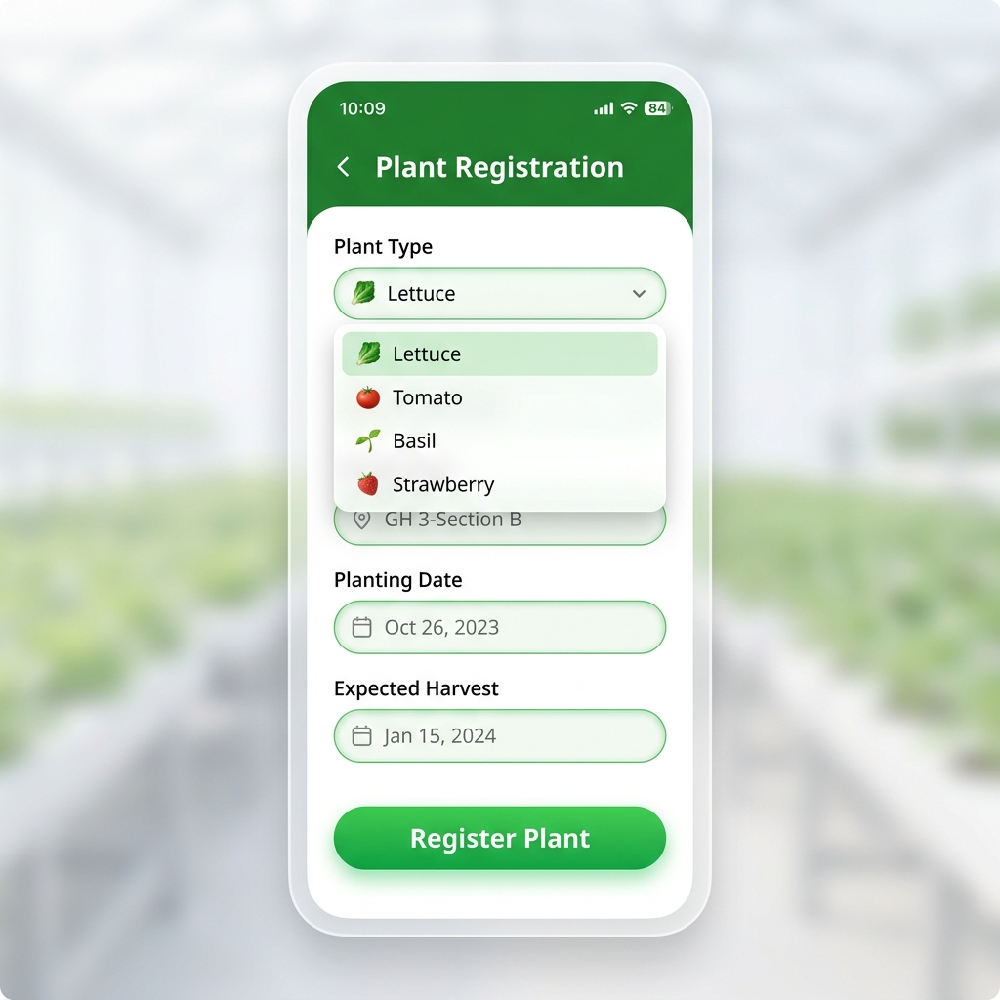

# 우주 팜 (OOJOO FARM) - UX/UI 프로토타입

현재 우주 팜 앱의 전반적인 사용자 경험(UX)과 사용자 인터페이스(UI) 디자인 컨셉을 정리한 문서입니다.

## 1. 디자인 시스템 & 컨셉
우주 팜은 **"미래형 스마트팜과 귀여운 반려 식물/로봇의 조화"**를 컨셉으로 삼고 있습니다.
* **색상 (Color Palette)**: 화이트(White)와 깨끗한 배경색을 베이스로, 생명력을 상징하는 선명하고 따뜻한 **그린(Green)**을 포인트 컬러로 사용합니다. 글씨는 부드러운 Muted 그레이를 사용하여 눈의 피로를 줄였습니다.
* **형태 (Shapes)**: 모든 카드, 버튼, 입력 폼은 둥근 모서리(Rounded Corners)를 적용하여 부드럽고 친근한 인상을 줍니다.
* **그림자 (Shadows & Glassmorphism)**: 은은한 Drop Shadow를 사용하여 카드와 컨텐츠가 배경 위로 떠 있는 듯한 입체감을 줍니다. 하단 네비게이션 바 등에는 반투명한 글래스모피즘(Glassmorphism) 효과를 주어 세련됨을 더했습니다.

## 2. 홈 화면 (Home Dashboard)
앱을 켰을 때 가장 먼저 보이는 대시보드로, 나의 농장 상태를 한눈에 파악할 수 있는 가장 중요한 화면입니다.

* **3D 인터랙티브 뷰어**: 기존의 평면적인 2D 이미지를 탈피하고 구글 Filament 3D 엔진을 적용했습니다. 사용자는 홈 화면 상단에서 자신의 식물(예: 상추, 토마토, 아보카도)과 담당 농부 로봇이 함께 있는 귀여운 3D 농장 풍경을 실시간으로 감상할 수 있습니다.
* **환경 데이터 카드**: 3D 농장 뷰 아래에는 온도, 습도, 토양 수분 등의 실시간 환경 데이터가 깔끔한 위젯 형태로 제공됩니다.
* **플로팅 바텀 네비게이션**: 화면 하단에는 둥근 알약 형태의 플로팅 네비게이션 바가 떠 있습니다. (홈, 식물, Farmer, 마켓, 이웃 등) 사용자가 탭을 누를 때마다 귀여운 바운스(Bounce) 애니메이션이 동작하여 터치하는 재미를 줍니다.

## 3. 식물 등록 화면 (Plant Registration)
새로운 작물을 스마트팜에 추가할 때 사용하는 입력 폼 화면입니다.

* **편리한 드롭다운 제안**: 사용자가 가장 많이 키우는 '상추, 방울토마토, 바질, 딸기' 등의 작물 목록을 드롭다운 메뉴로 제공하여 텍스트를 직접 치지 않아도 쉽게 선택할 수 있게 UX를 개선했습니다.
* **직관적인 폼 컨트롤**: 입력 폼에 초점이 맞춰질 때(Focus) 부드러운 초록색 테두리가 활성화되어 시각적인 피드백을 확실하게 제공합니다.
* **안내선 및 버튼**: 하단에는 화면 폭을 꽉 채우는 넓고 둥근 그라데이션 버튼("식물 등록")을 배치하여, 사용자가 모든 입력을 마치고 최종 액션을 명확하게 인지할 수 있도록 돕습니다.

## 4. 기타 주요 경험 (UX)
* **스켈레톤 로딩(Skeleton Loading)**: 서버에서 데이터를 불러올 때는 회색 빈 칸이 깜빡이는 형태의 스켈레톤 UI를 사용하여 로딩 대기 시간의 지루함을 덜었습니다.
* **즉각적인 피드백**: 식물 등록 완료 시 상단에 작은 카드 형태의 스낵바(Snackbar)나 인라인 알림을 띄워 사용자에게 확실한 성공 피드백을 전달합니다.
